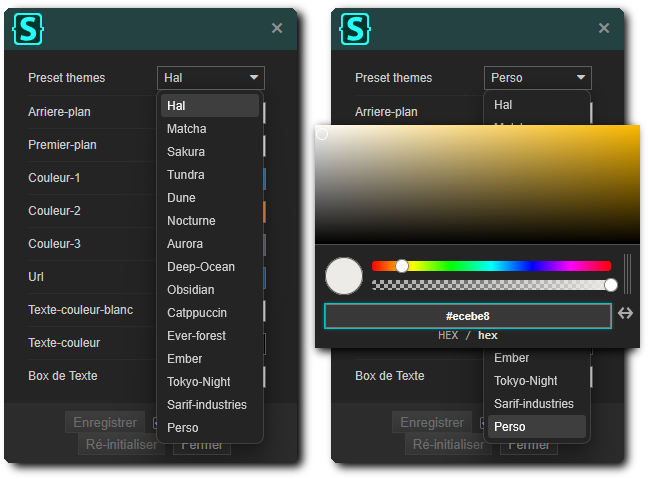
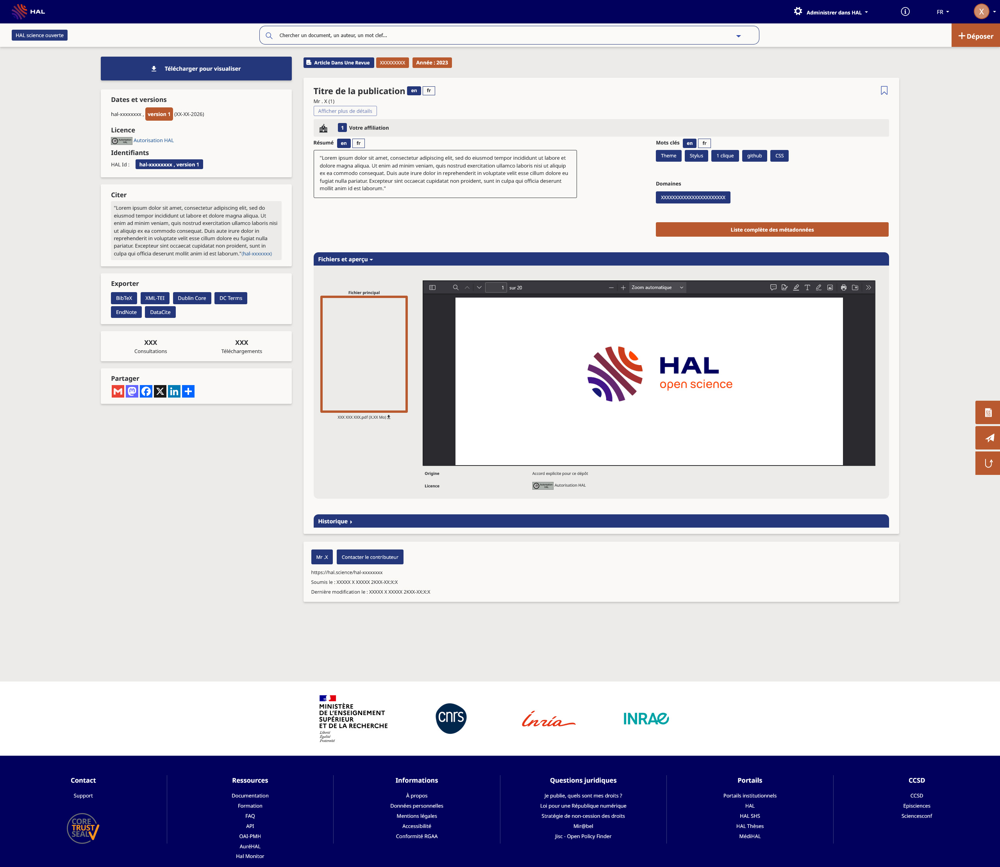
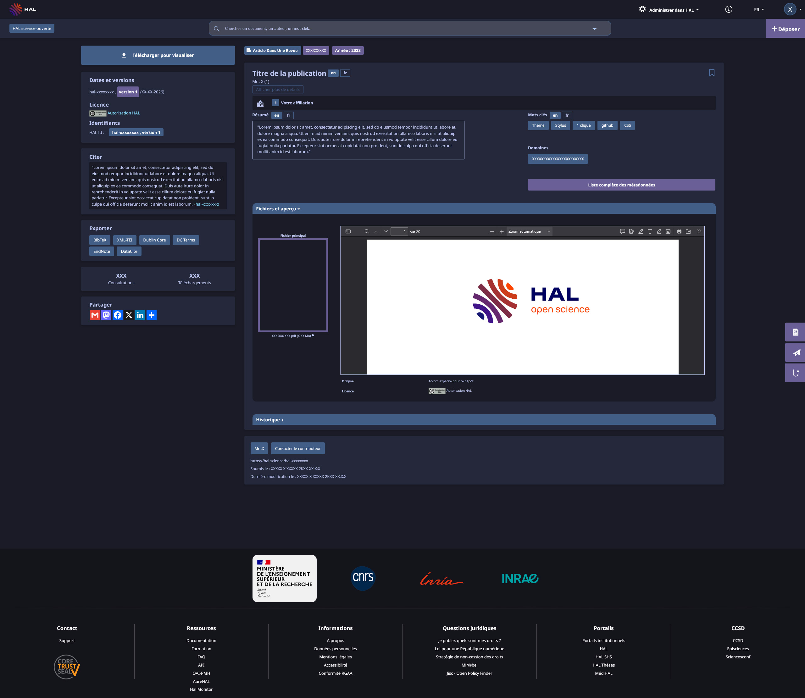
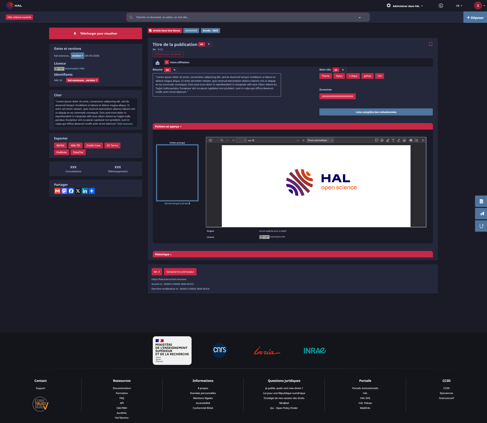

  
  
   

  

HAL+ est un script CSS conçu pour améliorer l'apparence et l'expérience utilisateur du portail HAL ainsi que de plusieurs portails partenaires.
Il propose une interface plus moderne, plus lisible et entièrement personnalisable selon vos préférences.
 
 
⚠️ Important : les pages de collections ne sont actuellement pas compatibles avec HAL+. Pour une expérience optimale, il est recommandé de désactiver temporairement le script lors de leur consultation.
 
 
⚠️ Si vous utilisez Edge, pensez à autoriser les extensions compatibles Chrome avant l’installation. Consultez la <a href="https://support.microsoft.com/fr-fr/microsoft-edge/ajouter-d%C3%A9sactiver-ou-supprimer-des-extensions-dans-microsoft-edge-9c0ec68c-2fbc-2f2c-9ff0-bdc76f46b026">documentation Microsoft</a> si nécessaire.
 
Si vous utilisez Safari, des alternatives à Stylus comme Cascadea peuvent être utilisées. Cependant, certaines fonctionnalités ou certains formats de styles peuvent ne pas être entièrement compatibles.
 
 

   
  
## Portail Compatible

  
## 🌐 Prise en charge du navigateur (↗ Sélectionnez votre navigateur)

Chrome ✅ • Firefox ✅ • Opera ✅ • Edge ⚠️ • Safari ⚠️

# ⚡Liens rapides

## 🌐 Liste des Portails

HAL+ est compatible avec plusieurs portails et instances HAL. Le script adapte automatiquement son apparence afin d’offrir une expérience plus homogène sur les différentes plateformes prises en charge.

| Portail | Description |
|---|---|
| ✅ [HAL](https://hal.science/) | Portail HAL principal regroupant l’ensemble des publications scientifiques. |
| ✅ [HAL Inria](https://inria.hal.science/) | Portail dédié aux travaux et publications de l'Inria. |
| ✅ [HAL INRAE](https://hal.inrae.fr/) | Portail des publications de l’Institut national de recherche pour l’agriculture, l’alimentation et l’environnement. |
| ✅ [HAL SHS](https://shs.hal.science/) | Portail dédié aux sciences humaines et sociales. |
| ✅ [HAL CNRS](https://cnrs.hal.science/) | Portail regroupant les publications liées au CNRS. |
| ✅ [HAL Thèses](https://theses.hal.science/) | Accès aux thèses et travaux académiques déposés sur HAL. |
| ✅ [Université Paris-Saclay](https://universite-paris-saclay.hal.science/) | Portail institutionnel des publications de l’Université Paris-Saclay. |
| ✅ [Sorbonne Université](https://hal.sorbonne-universite.fr/) | Portail des publications et travaux de Sorbonne Université. |

## Installation 

## 🚀 Installation

1. Téléchargez l’extension de gestion des styles utilisateur en cliquant sur l’icône correspondant à votre navigateur ci-dessus.

2. Cliquez ensuite sur **Téléchargement**. Une nouvelle fenêtre s’ouvrira : il vous suffira de cliquer sur **Ajouter** ou **Installer** pour installer HAL+.

3. Une fois l’installation terminée, une icône **S** apparaîtra dans la barre d’outils de votre navigateur ou dans le menu des extensions.

Une fois HAL+ installé, rendez-vous sur **HAL** ou sur l’une des **instances compatibles** puis cliquez sur l’icône **S** de Stylus.

Le thème est activé automatiquement après l’installation. Vous pouvez à tout moment l’activer ou le désactiver en cochant ou décochant la case correspondant à **HAL+** dans le menu de Stylus.

## 🎨 Thèmes disponibles

HAL+ intègre plusieurs modèles de couleurs disponibles en versions claires et sombres afin d’adapter l’interface à vos préférences.

La sélection et la configuration des thèmes s’effectuent directement depuis le menu de Stylus via `l'icône ⚙`.

| Thème | Description |
|---|---|
| 🟦 **Hal** | Inspiré de l’identité visuelle HAL avec des tons bleu profond et orange. Le thème par défaut. |
| 🍵 **Matcha** | Palette douce aux nuances vertes naturelles. Une interface apaisante pensée pour les longues sessions. |
| 🌸 **Sakura** | Ambiance légère aux teintes rosées. Un thème chaleureux et élégant. |
| ❄️ **Tundra** | Tons froids gris-bleu sobre, propre et minimaliste. |
| 🏜️ **Dune** | Nuances sable pour une atmosphère douce et naturelle. |
| 🌙 **Nocturne** | Palette sombre bleu-violet conçue pour un confort visuel optimal en environnement peu éclairé. |
| 🌌 **Aurora** | Inspiré des aurores boréales avec des nuances froides bleu-vert. Ambiance moderne et immersive. |
| 🌊 **Deep Ocean** | Tons bleu profond inspirés des fonds marins. Une expérience sombre sobre et reposante. |
| 🪨 **Obsidian** | Thème sombre aux accents minéraux violet-gris. Minimaliste et élégant. |
| 🐱 **Catppuccin** | Inspiré de la célèbre palette Catppuccin. Une interface douce avec des contrastes harmonieux. |
| 🌲 **Ever Forest** | Tons verts naturels et boisés inspirés des forêts profondes. Ambiance calme et organique. |
| 🔥 **Ember** | Palette chaude aux teintes braise et cuivre. Une ambiance plus chaleureuse et contrastée. |
| 🏙️ **Tokyo Night** | Inspiré du thème Tokyo Night avec un mélange de bleu néon et d’accents rouges. |
| 🏭 **Sarif Industries** | Inspiré de Deus Ex: Human Revolution. Associe des teintes sombres et métalliques à des accents dorés pour une interface moderne et sophistiquée. |
| 🎨 **Perso** | Créez votre propre palette de couleurs et personnalisez intégralement l'apparence de HAL+. |

  
</a>

  
## 🔄 Problèmes 

Il peut arriver occasionnellement qu’un problème empêche HAL+ de s'afficher correctement ou que certains éléments visuels présentent un comportement inattendu.
Dans la majorité des cas, la solution est simple : supprimez le script depuis Stylus puis réinstallez-le. Cela permet généralement de corriger les problèmes liés à une mise à jour incomplète ou à un cache obsolète.

## 🚧 Évolutions futures

De nouvelles mises à jour pourront être déployées en fonction des retours utilisateurs, des bugs remontés ou des suggestions de nouvelles fonctionnalités.

## 🔄 Vérifier les mises à jour

Pour vérifier si une nouvelle version de HAL+ est disponible, ouvrez Stylus puis rendez-vous dans le **Gestionnaire**.

Repérez ensuite le script **HAL+** puis cliquez sur **Rechercher une mise à jour**. Si une nouvelle version est disponible, elle sera téléchargée et installée automatiquement.

# Aperçu 

<h2>🎨 Aperçu des thèmes</h2>

<i>🔍 Cliquez sur une image pour agrandir</i>

# Contribution et Développement
