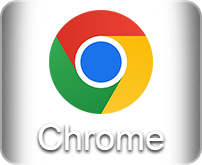
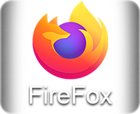
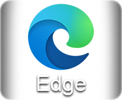
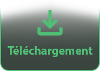
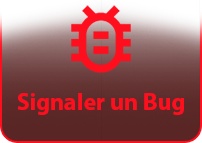

<p align="center">
  
  
  <br>
</p>  
<p align="left">
HAL+ est un script CSS conçu pour améliorer l'apparence et l'expérience utilisateur du portail HAL ainsi que de plusieurs portails partenaires.
Il propose une interface plus moderne, plus lisible et entièrement personnalisable selon vos préférences.
<br>
<br>
⚠️ Important : les pages de collections ne sont actuellement pas entièrement compatibles avec HAL+. Pour une expérience optimale, il est recommandé de désactiver temporairement le script lors de leur consultation.
<br>
<br>
Si vous utilisez Safari, des alternatives à Stylus comme Cascadea peuvent être utilisées. Cependant, certaines fonctionnalités ou certains formats de styles peuvent ne pas être entièrement compatibles.
<br>
<br>
⚠️ Si vous utilisez Edge, pensez à autoriser les extensions compatibles Chrome avant l’installation. Consultez la <a href="https://support.microsoft.com/fr-fr/microsoft-edge/ajouter-d%C3%A9sactiver-ou-supprimer-des-extensions-dans-microsoft-edge-9c0ec68c-2fbc-2f2c-9ff0-bdc76f46b026">documentation Microsoft</a> si nécessaire.
<br>
</p>
   
  
## Portail Compatible

  
  
## 🌐 Prise en charge du navigateur ( ↗ Cliquez sur l'icône qui correspond à votre navigateur )

<p align="center">
<a href="https://chromewebstore.google.com/detail/stylus/clngdbkpkpeebahjckkjfobafhncgmne?hl=fr">
  
</a>

<a href="https://addons.mozilla.org/fr/firefox/addon/styl-us/">
  
</a>

<a href="https://addons.opera.com/en/extensions/privacy_policy/27c0f4146c879f67a91b70f93f4eee4a01846fdd/">
  
</a>

<a href="https://chromewebstore.google.com/detail/stylus/clngdbkpkpeebahjckkjfobafhncgmne?hl=fr">
  
</a>

<a href="https://cascadea.app/">
  
</a>

</p>
<p align="center">
Firefox ✅ • Chrome ✅ • Opera ✅ • Edge ⚠️ • Safari ⚠️
</p>

# ⚡Liens rapides

<p align="center">
<a href="https://raw.githubusercontent.com/Hypersoby/Hal-Plus-Script/master/Hal+.user.css">
  
</a>

<a href="#comment-faire">
  
</a>

<a href="./CHANGELOG.md">
  
</a>

<a href="../../issues/new">
  
</a>

<a href="mailto:hyperlightsupersoby@gmail.com?subject=HAL%2B">
  
</a>

</p>


## Installation 
Installer [Stylus pour Firefox](https://addons.mozilla.org/fr/firefox/addon/styl-us/), [Chrome](https://chrome.google.com/webstore/detail/stylus/clngdbkpkpeebahjckkjfobafhncgmne), [Opera](https://addons.opera.com/en-gb/extensions/details/stylus/) ou [Cascadea pour Safari](https://cascadea.app/).
  
Si vous êtes sur le Navigateur Edge veuillez vous référer à la [Documentation de Microsoft](https://support.microsoft.com/fr-fr/microsoft-edge/ajouter-d%C3%A9sactiver-ou-supprimer-des-extensions-dans-microsoft-edge-9c0ec68c-2fbc-2f2c-9ff0-bdc76f46b026) pour pouvoir activer les extensions Chrome sur ce navigateur.

Cependant aucun support n'est disponible pour le navigateur Internet Explorer dû à l'ancienneté du navigateur.

1. Cliquez sur le lien qui correspond à votre navigateur puis installer le script en cliquant sur le bouton`ajouter/installer`.

2. Une icône représentant un `S` s'ajoutera en haut de votre navigateur dans la barre de navigation. 


3. *Si vous utilisez `Chrome` cliquez sur l'icône en forme de `puzzle` et épinglez ensuite `Stylus` dans votre barre de navigation.*


4. Pour télécharger et installer le Script, il vous suffit de cliquer sur le liens `Script Umbrhal` ci-dessous puis de cliquer sur installer sur le panneau de gauche. /!\ Vous pourrez ensuite fermer l'onglet /!\

## Lien de téléchargement 

Le Thème Sombre `Umbrhal` : 
  
  

 
Une fois l'installation complète, rendez-vous sur le site `Hal Inria` puis cliquez sur l'icône `S` de l'extension Stylus.

<br>
Cliquez sur la `case ☐` correspondant au(x) script(s) que vous souhaitez activer pour l'appliquer sur le site. 

# Contenu

1. `Harmonisation` du site pour une navigation plus facile.
```
- Thème Sombre. Sobre et reposant, basculez du côté obscur en un clic.
- La palette de couleurs a été vérifier à l'aide de divers outils pour favoriser l'accessibilité.
```

2. `Style de couleur` pour varier les nuances.
```
- Ce script propose aussi un panneau complet pour personnaliser et créer votre propre thème
```

# Personnalisation  
  
Pour personnaliser les couleurs de votre thème, rendez-vous sur le site `Hal Inria` puis cliquez sur l'icône `S` de l'extension Stylus.
<br>
Cliquez sur `l'icône ⚙` pour ouvrir le panneau de personnalisation.  
  
Un panneau s'offre à vous avec plusieurs options de personnalisation. Vous pourrez ainsi cliquer sur la couleur que vous souhaitez modifier.
Pour une meilleure personnalisation je vous propose cet Outil <a href="https://webaim.org/resources/contrastchecker/">Contrast Checker</a> pour vérifier la lisibilité vos couleurs
<br>  

  
## Note de patch

Des notes sur les mises à jour seront ajoutées à chaque correctif. Voir ci-dessus.

## Dépannage

Parfois les scripts peuvent rencontrer un problème et vous disent qu'ils ne peuvent pas se `mettre à jour`.
Ou bien qu'après mises à jour vous rencontrez des bugs visuels.
La solution est toute bête, il vous suffit de supprimer le script et de le réinstaller à nouveau.

## Mise à jour

Des `mises à jour` pourront être disponibles dans le futur en faisant `remonter les bugs` ou suite à `une demande de fonctionnalité`.

1. Pour voir si un script est à jour, rendez-vous dans l'extension Stylus en cliquant sur `S` puis sur `Gestion`


2. Sur le panneau de droite qui contient les scripts, rendez-vous sur la ligne du script puis cliquez sur l'icône `⟲` pour vérifier si une mise à jour est possible. 


# Aperçu 

<p align="center">
<br>
  


# Contribution et Développement
